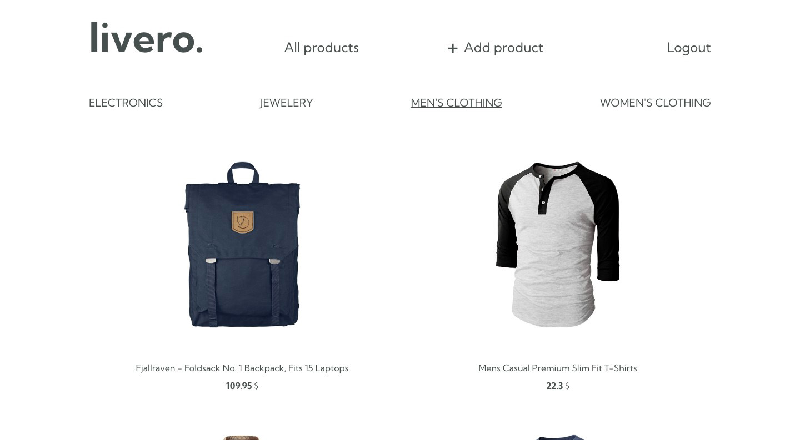
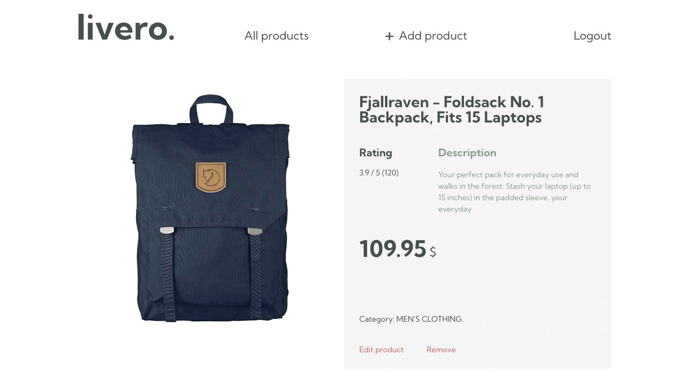
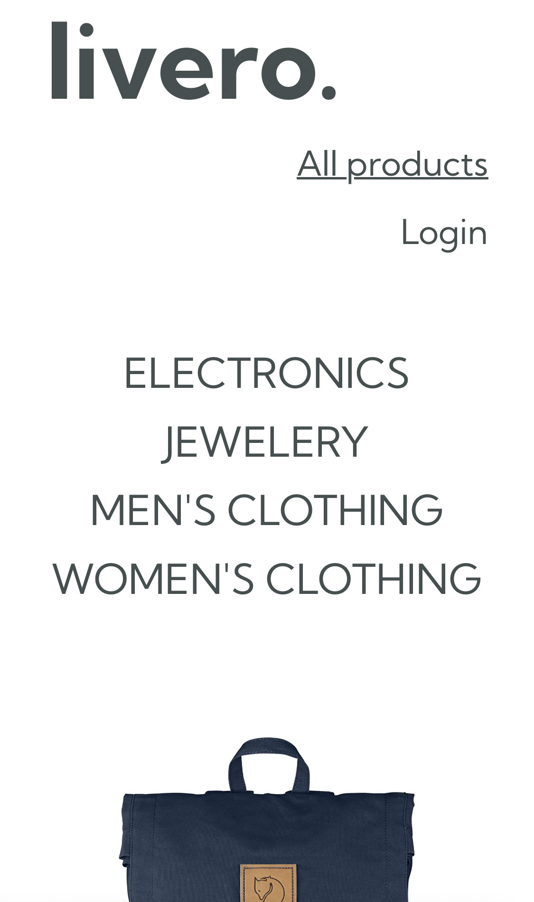

[](https://app.netlify.com/sites/mbukh-mini-crud-shop/deploys)

This is a simple store app built with React that allows users to view and manage products and categories.

|  |
| :--------------------------: |

## Functionality

The app uses both a remote API and localStorage to store and update data. It provides CRUD (Create, Read, Update, Delete) functionality for products and categories.

The following routes are available:

-   `/`: displays all categories and products
-   `/login`: allows users to log in
-   `/category/:category`: displays products in the specified category
-   `/product/add`: allows admins to add a new product
-   `/product/:id`: displays details for a specific product
-   `/product/:id/remove`: allows admins to remove a product
-   `/product/:id/edit`: allows admins to edit a product

## Design

The app design was inspired by [this Behance project](https://www.behance.net/gallery/92212755/Livero-Minimalistic-design-for-online-furniture-store?tracking_source=search_projects%7Cminimalistic+online+shop). It uses the `normalize.css` and `reset-css` libraries for consistent styling.

|  |
| :--------------------------: |

## Getting Started

To get started with the app, clone the repo and install dependencies:

```bash
npm install
```

Then start the app:

```bash
npm start
```

## Dependencies

The app relies on the following dependencies:

-   `react`: for building the UI
-   `react-router-dom`: for client-side routing
-   `axios`: for making API requests
-   `normalize.css`: for consistent styling
-   `reset-css`: for consistent styling

|  |
| :--------------------------: |

## API

The app uses a remote API to get data and local API to update and remove data. The `api.js` file handles interactions with the API, as well as with localStorage.
